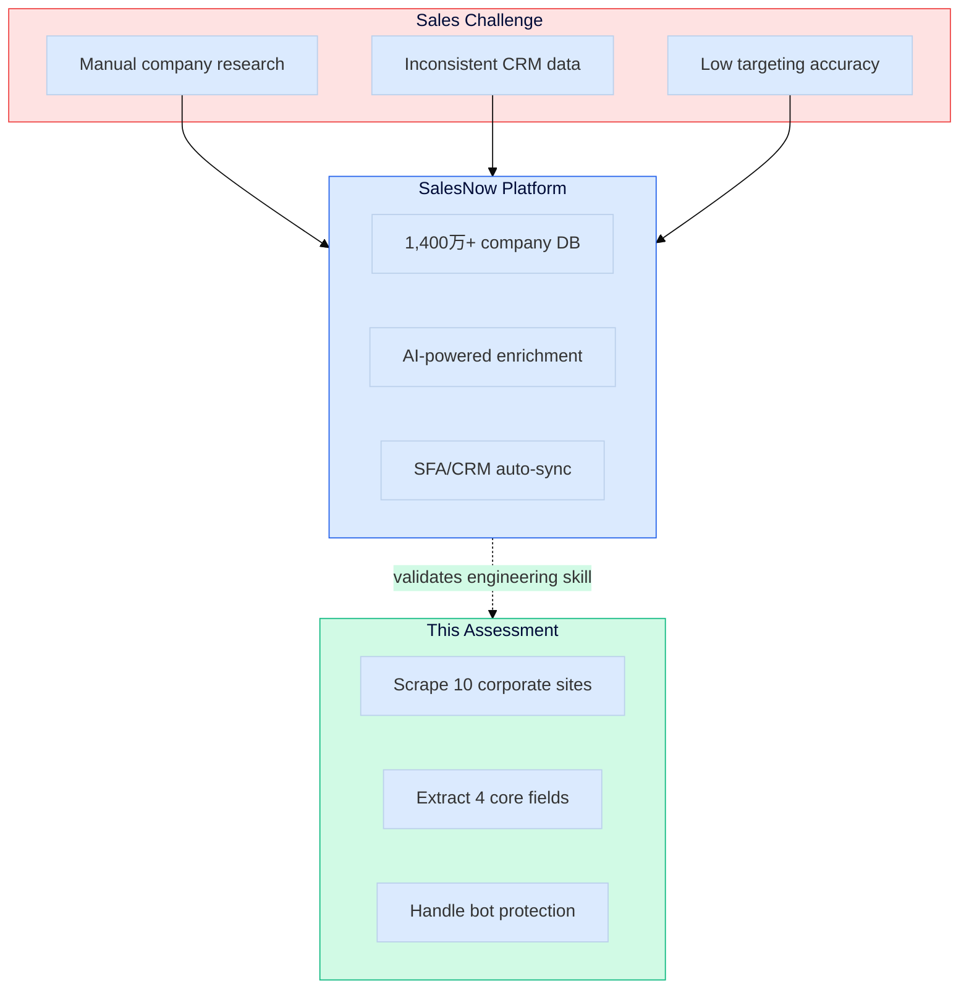
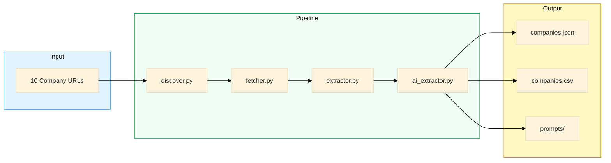
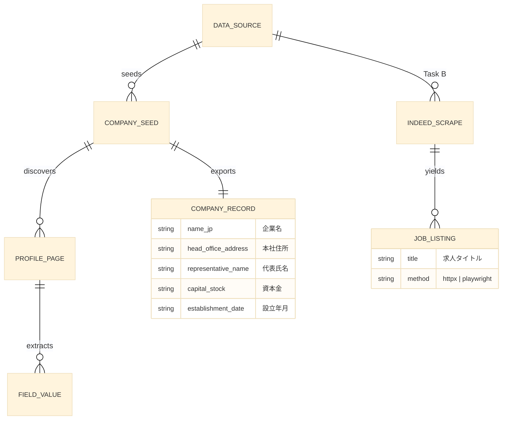
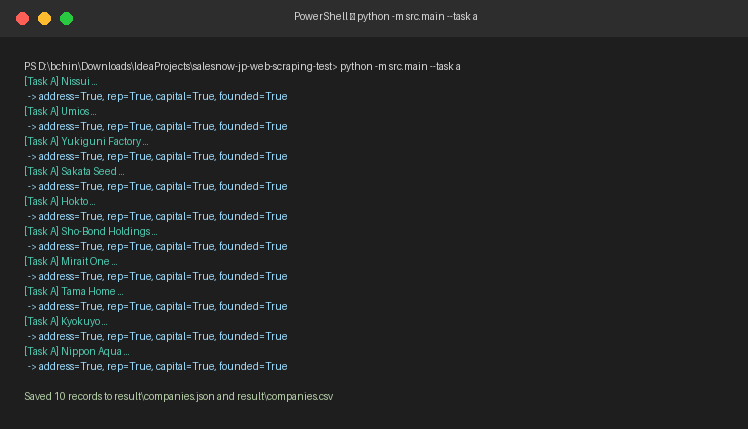
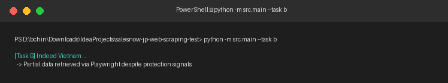
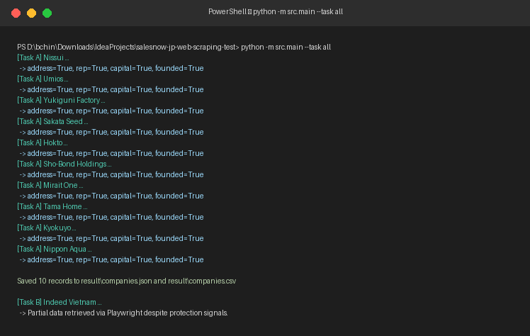
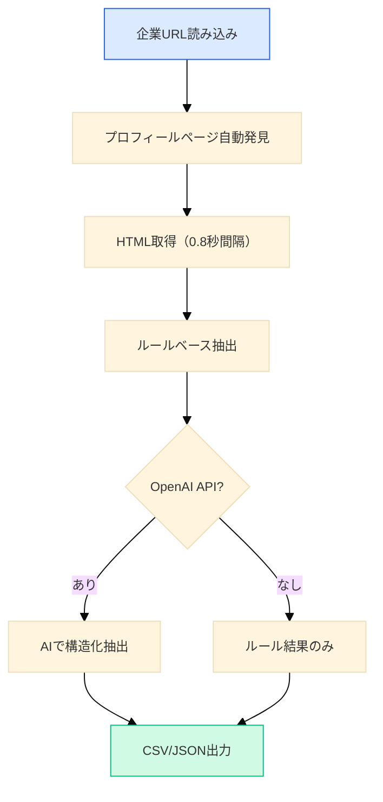
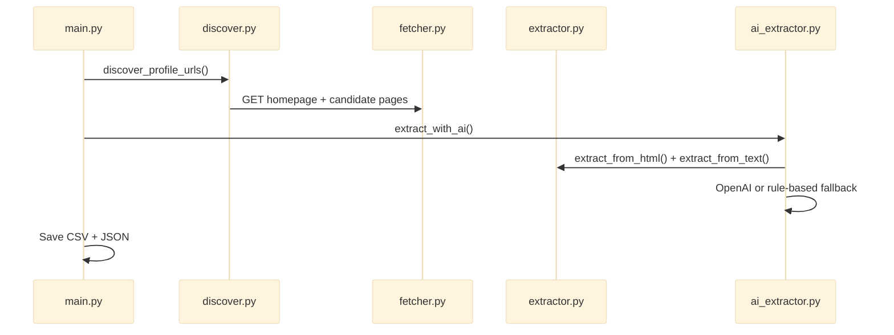
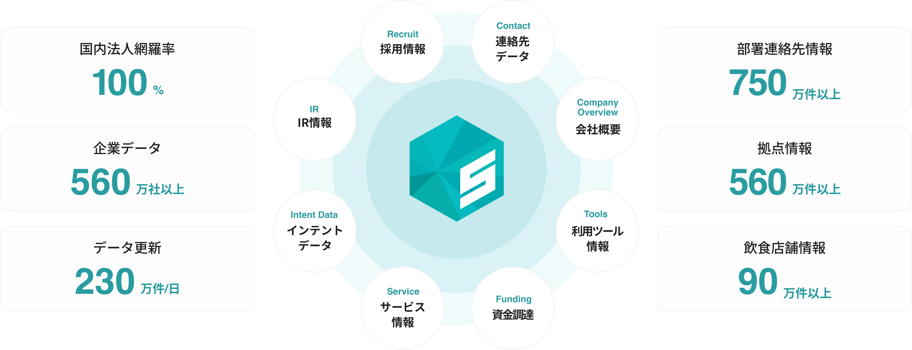

# Web Scraping & Data Extraction Test

<p align="center">
  
  <br/><br/>
  <strong>Technical assessment submission</strong> for <a href="https://salesnow.jp/">SalesNow</a> (株式会社 SalesNow)
  <br/>Japan's No.1 B2B corporate database SaaS — 1,400万+ company records
</p>

<p align="center">
  
  
  
</p>

---

## Overview

This repository contains my solution for SalesNow's **Web Scraping and Data Extraction** practical test — the same core capability that powers [SalesNow's company enrichment](https://salesnow.jp/) (本社住所, 資本金, 代表者, 設立年月, and more).

| Evaluated Skill | How This Repo Demonstrates It |
|-----------------|-------------------------------|
| Data collection | Generic scraper across 10 heterogeneous JP corporate sites |
| Technical decisions | Documented comparison in [`report.md`](report.md) and [`docs/ARCHITECTURE.md`](docs/ARCHITECTURE.md) |
| Generative AI | Prompt templates + saved history in `prompts/` |

---

## Business Context



---

## Solution Architecture



> Full diagrams: [`docs/ARCHITECTURE.md`](docs/ARCHITECTURE.md)

---

## Database Design

Logical ER model for crawled data across corporate sites (Task A) and Indeed (Task B):



Full schema, source mapping & field dictionary → [`docs/DATABASE.md`](docs/DATABASE.md)

---

## Assignment Summary

### Task A — Scrape Corporate Websites (Required)

| Company | URL |
|---------|-----|
| Nissui (ニッスイ) | https://www.nissui.co.jp/ |
| Umios (Ｕｍｉｏｓ) | https://www.umios.com/ |
| Yukiguni Factory (ユキグニファクトリー) | https://www.yukiguni-factory.co.jp/ |
| Sakata Seed (サカタのタネ) | https://www.sakataseed.co.jp/ |
| Hokto (ホクト) | https://www.hokto-kinoko.co.jp/ |
| Sho-Bond Holdings (ショーボンドホールディングス) | https://www.sho-bondhd.jp/ |
| Mirait One (ミライト・ワン) | https://www.mirait-one.com/ |
| Tama Home (タマホーム) | https://www.tamahome.jp/ |
| Kyokuyo (極洋) | https://www.kyokuyo.co.jp/ |
| Nippon Aqua (日本アクア) | https://www.n-aqua.jp/ |

| Field (JP) | Field (EN) |
|------------|------------|
| 本社住所 | Head office address |
| 代表氏名 | Representative name |
| 資本金 | Capital stock |
| 設立年月 | Date of establishment |

### Task B — Bot-Protected Site (Bonus)

Target: https://vn.indeed.com/jobs?q=remote — documented in [`report.md`](report.md)

---

## Repository Structure

```
salesnow-jp-web-scraping-test/
├── docs/
│   ├── ARCHITECTURE.md    # Visual design docs & mermaid diagrams
│   ├── DATABASE.md        # ER model for multi-source crawled data
│   └── assets/            # SalesNow reference images
├── prompts/               # AI prompt & response history
├── result/                # Scraped output (CSV/JSON)
├── src/                   # Scraper source code
│   ├── main.py            # CLI entrypoint
│   ├── discover.py        # Profile page discovery
│   ├── fetcher.py         # HTTP client
│   ├── extractor.py       # Rule-based field parsing
│   ├── ai_extractor.py    # LLM extraction layer
│   └── indeed_scraper.py  # Task B bot-protection attempt
├── README.md
└── report.md
```

---

## Setup & Execution

### Prerequisites

- Python 3.11+
- Optional: `OPENAI_API_KEY` for AI-enhanced extraction

### Install

```bash
pip install -r requirements.txt
python -m playwright install chromium   # JS pages (Umios) + Task B
```

### Run

```bash
# Task A only
python -m src.main --task a

# Task B only
python -m src.main --task b

# Both tasks
python -m src.main --task all
```

### Verified execution (screenshots)

Real terminal output from a successful run on Windows PowerShell:

| Task A — 10 companies | Task B — Indeed | Full pipeline |
|:---:|:---:|:---:|
|  |  |  |

See also [`docs/screenshots/README.md`](docs/screenshots/README.md) and raw logs in `docs/run-logs/`.

### Optional: Enable AI extraction

```bash
export OPENAI_API_KEY="sk-..."
export OPENAI_MODEL="gpt-4o-mini"   # default
python -m src.main --task a
```

---

## 環境構築・実行方法

### 必要環境

- Python 3.11 以上
- 任意: OpenAI API キー（AI による抽出を有効化する場合）

### セットアップ

```bash
pip install -r requirements.txt
python -m playwright install chromium   # JSページ（Umios等）+ 課題B
```

### 実行方法

```bash
# 課題Aのみ（10社の企業情報スクレイピング）
python -m src.main --task a

# 課題Bのみ（Indeed ボット対策サイト）
python -m src.main --task b

# 両方実行
python -m src.main --task all
```

### 出力ファイル

| ファイル | 内容 |
|----------|------|
| `result/companies.csv` | 10社分の抽出結果（Excel対応 UTF-8 BOM） |
| `result/companies.json` | 同上 JSON 形式 |
| `prompts/task_a_*.txt` | 各社の AI プロンプト履歴 |
| `prompts/task_a_*_response.txt` | AI レスポンスまたはルールベース結果 |
| `result/indeed_remote_jobs.json` | 課題Bの調査結果 |
| `prompts/task_b_*.txt` | 課題Bのプロンプト・結果 |
| `docs/screenshots/` | 実行成功時のターミナル画面キャプチャ |

### 実行確認（スクリーンショット）

実際の PowerShell 実行結果: [`docs/screenshots/task-a-run.png`](docs/screenshots/task-a-run.png)

### 処理の流れ



---

## Main Code Flow



---

## Technology Selection

| Approach | Cost | Speed | Quality | Used |
|----------|:----:|:-----:|:-------:|:----:|
| Python httpx + BeautifulSoup + rules | ⭐⭐⭐ | ⭐⭐⭐ | ⭐⭐ | ✅ |
| + OpenAI structured extraction | ⭐⭐ | ⭐⭐ | ⭐⭐⭐ | ✅ |
| TypeScript Firecrawl + AI SDK | ⭐ | ⭐⭐ | ⭐⭐⭐ | — |
| n8n / Dify no-code | ⭐⭐ | ⭐ | ⭐⭐ | — |

See [`report.md`](report.md) for full rationale.

---

## Generative AI Usage

Chat-based AI (Cursor / Claude) was used for development. Per-company extraction prompts are saved under `prompts/`.

---

## Submission

| Item | Detail |
|------|--------|
| Repository | https://github.com/willtran112358/salesnow-jp-web-scraping-test |
| Collaborators | `atsunori0406`, `yuji-um`, `salesnow-tomohiro` |

---

## License

Private assessment submission for SalesNow. Not for public distribution.

<p align="center">
  
  <br/>
  <em>© SalesNow Co., Ltd. — images used for assessment documentation only.</em>
</p>
