# Architecture & Visual Design Reference

> Solution design documentation for the SalesNow Web Scraping & Data Extraction technical test.

  
   
  

---

## 1. Business Context — Why SalesNow Cares About Web Scraping

[SalesNow](https://salesnow.jp/) is Japan's **No.1 B2B corporate database** (1,400万+ records). Their product automates exactly what this test evaluates: collecting structured company data from diverse corporate websites.

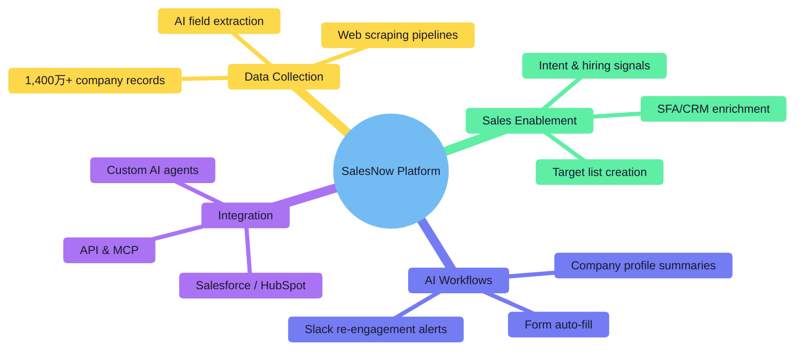

### Sales Pain Points → Test Alignment

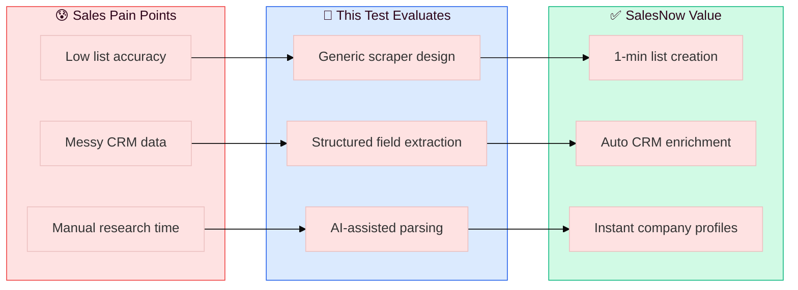

---

## 2. Assignment Requirements Map

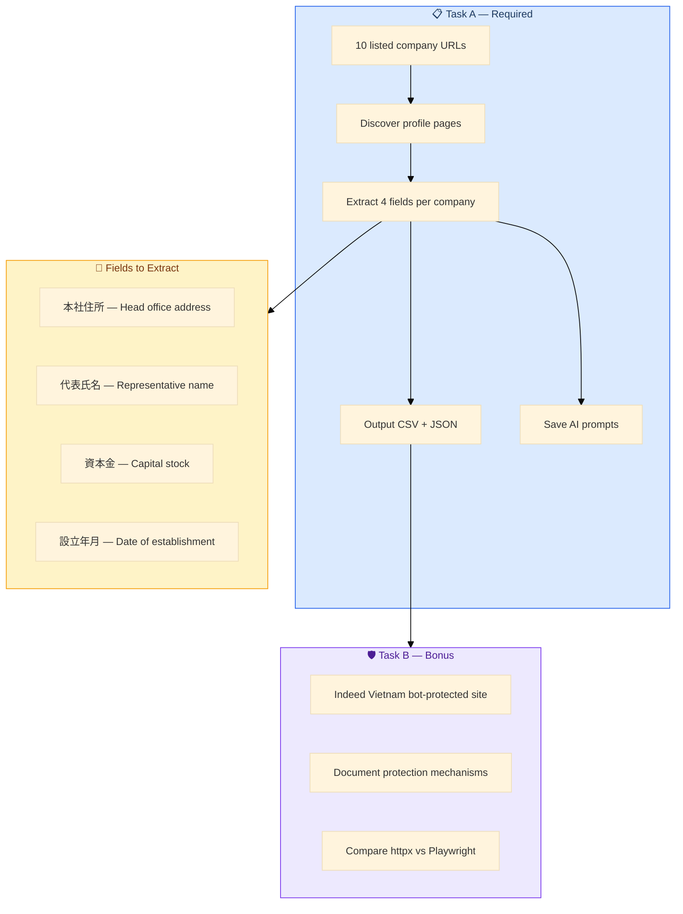

---

## 3. Solution Design — High-Level Architecture

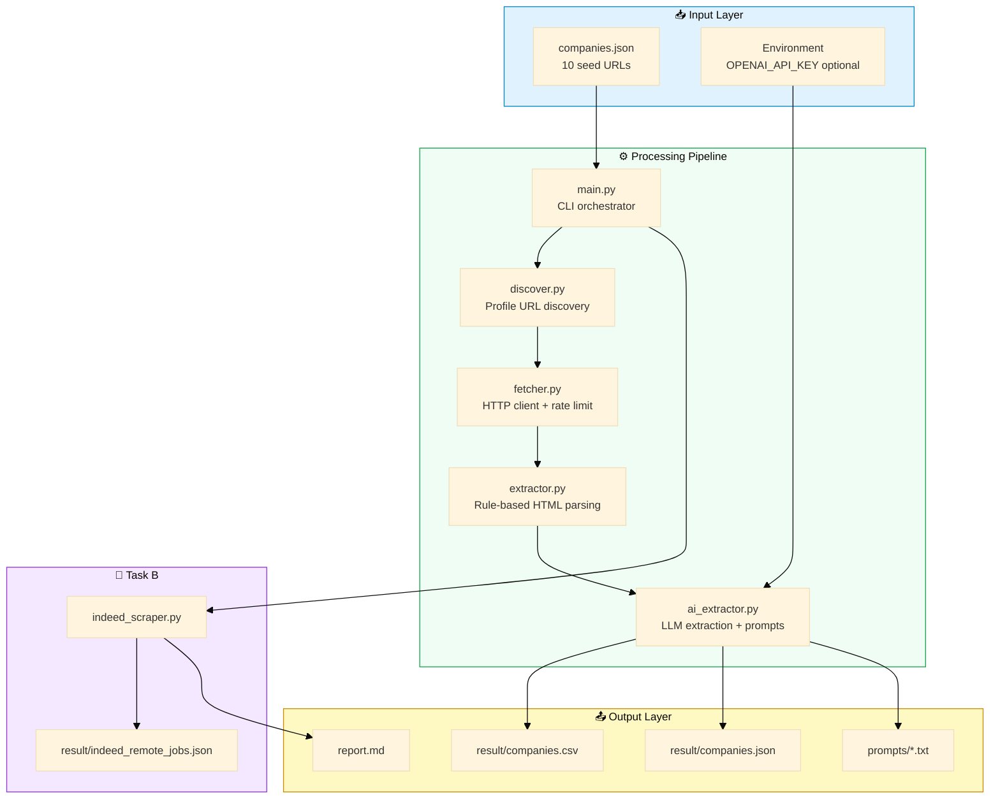

### Design Principles

| Principle | Implementation |
|-----------|----------------|
| **Generic & reusable** | Keyword-based link scoring + fallback path candidates |
| **Resilient extraction** | Rule-based parser first, AI enrichment second |
| **Transparent AI usage** | Every prompt/response saved to `prompts/` |
| **Graceful degradation** | Works without API key via rule-based fallback |
| **Polite crawling** | Configurable delay between requests (default 0.8s) |

---

## 4. Database ER Model

Multi-source crawled data is modeled as seed → page → field → record. See [`DATABASE.md`](DATABASE.md) for the full schema.

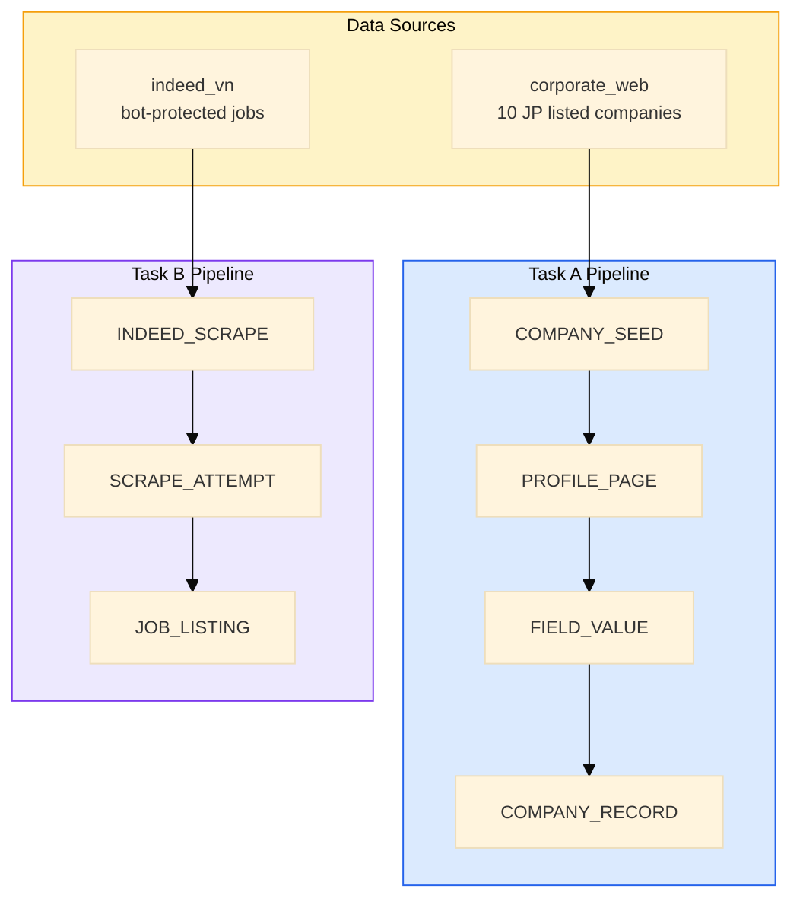

---

## 5. Technology Selection Matrix

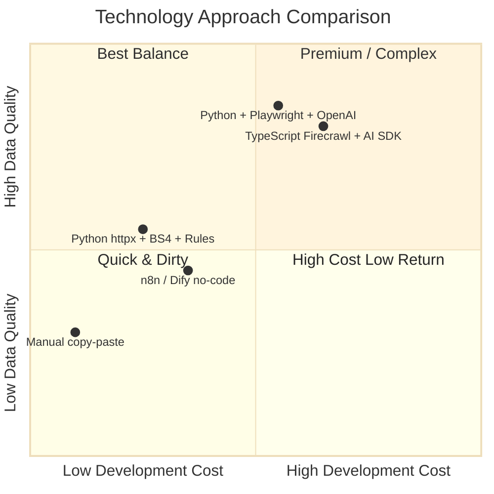

| Approach | Cost | Speed | Quality | Selected |
|----------|:----:|:-----:|:-------:|:--------:|
| **Python httpx + BeautifulSoup + rules** | ⭐⭐⭐ | ⭐⭐⭐ | ⭐⭐ | ✅ Base layer |
| **+ OpenAI structured extraction** | ⭐⭐ | ⭐⭐ | ⭐⭐⭐ | ✅ AI layer |
| TypeScript + Firecrawl + Vercel AI SDK | ⭐ | ⭐⭐ | ⭐⭐⭐ | ❌ Higher setup cost |
| n8n / Dify no-code | ⭐⭐ | ⭐ | ⭐⭐ | ❌ Less control for 10 heterogeneous sites |
| Playwright-only (no AI) | ⭐⭐ | ⭐ | ⭐⭐ | ❌ Slower, still needs parsing logic |

**Selection rationale:** Python stack offers the best balance for a 9-hour test — fast to develop, no browser infra for Task A, and optional LLM for ambiguous layouts.

---

## 6. Engineering — Main Function Flow (Task A)

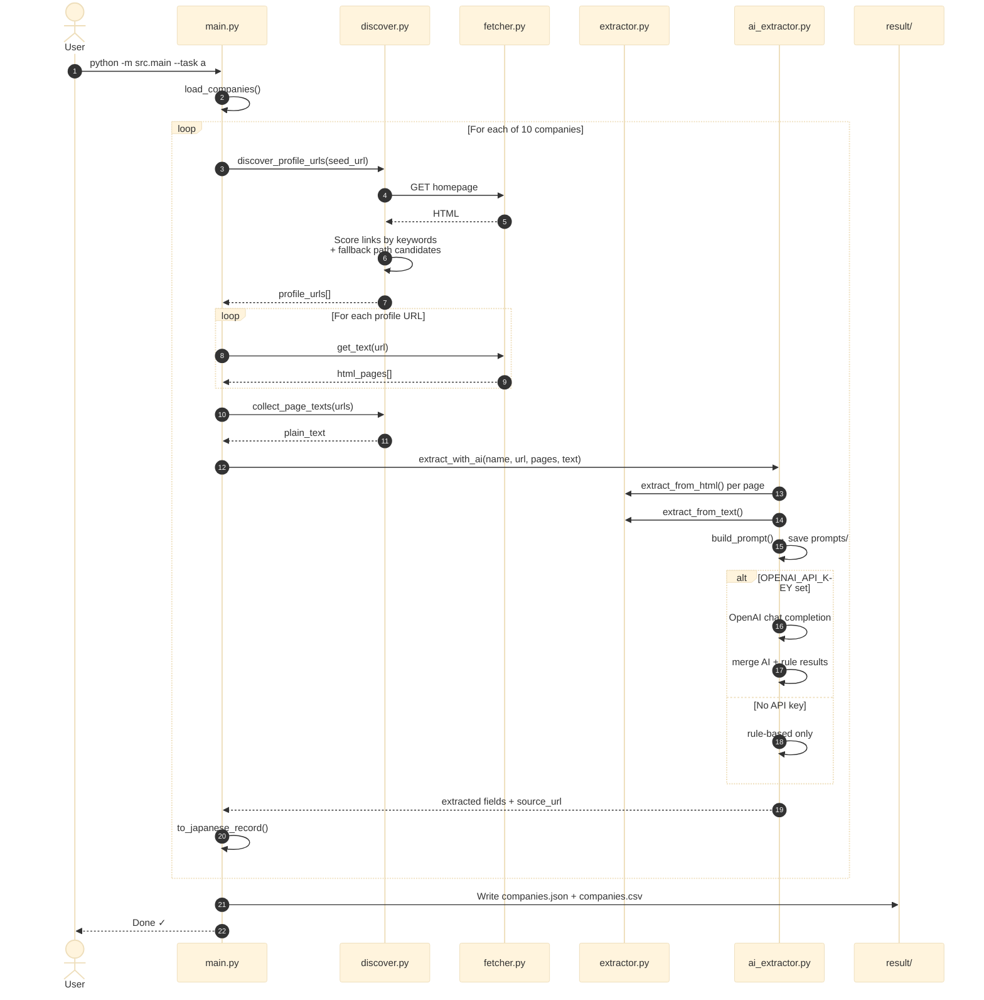

### Profile URL Discovery Logic

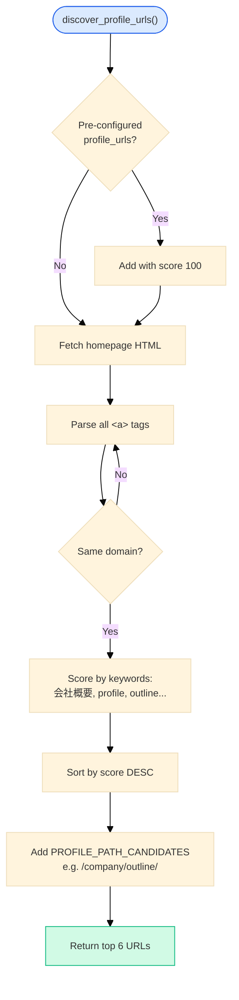

### Field Extraction Pipeline

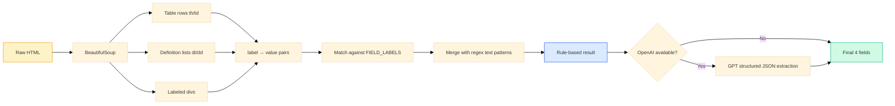

---

## 7. Task B — Bot Protection Flow

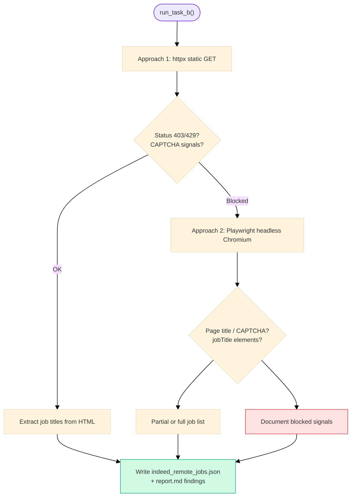

---

## 8. Data Flow — End to End

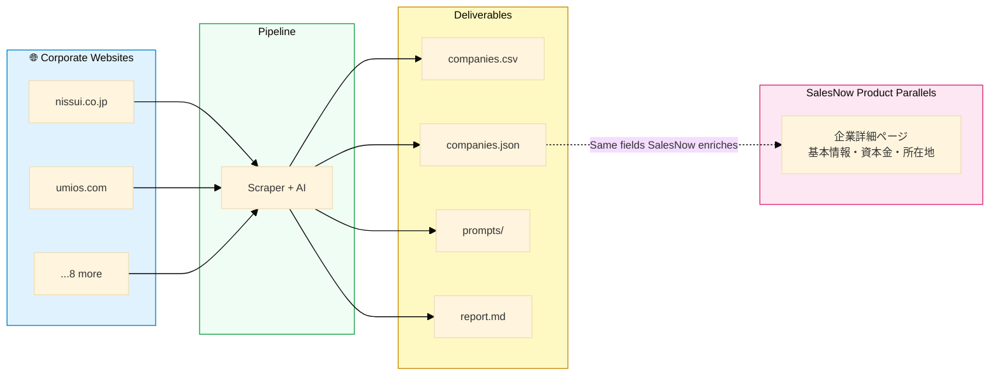

---

## 9. Module Dependency Graph

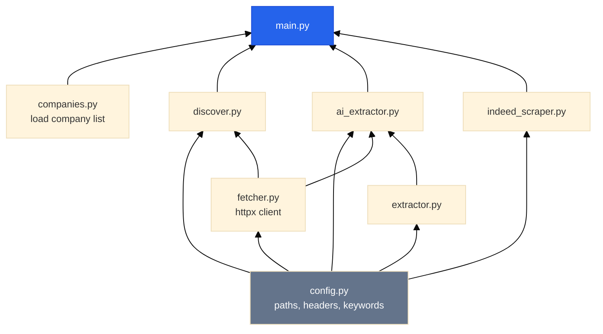

---

  
  
  

*Documentation for SalesNow technical assessment — Will Tran*
