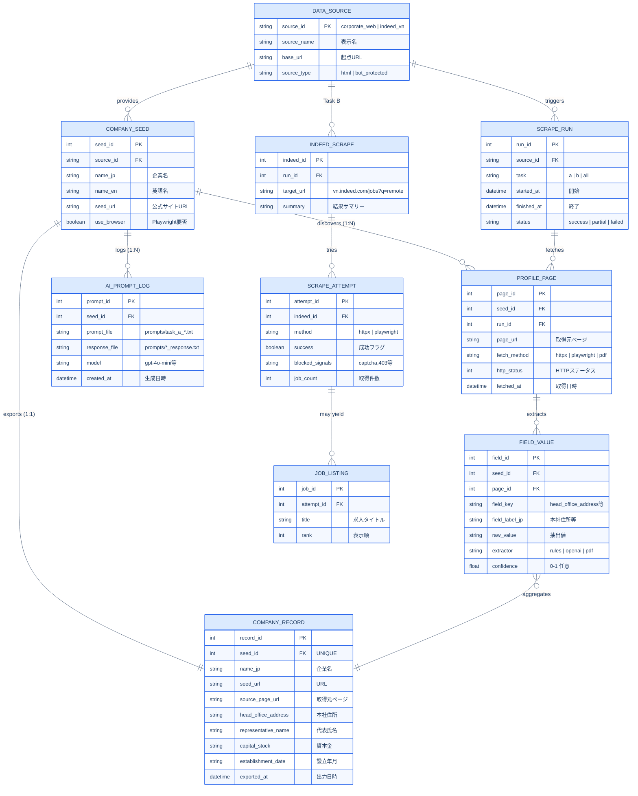
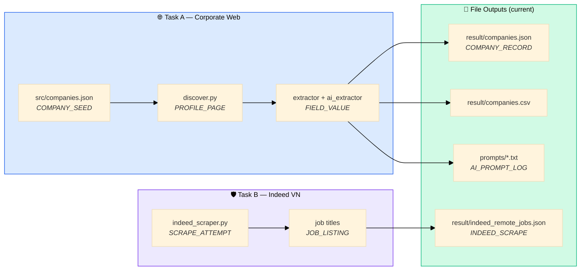

# Database Design — Crawled & Extracted Data

> Logical data model for multi-source scraping outputs (Task A corporate sites + Task B Indeed).

---

## Source → Storage Mapping

---

## Entity Summary

| Entity | Role | Current file |
|--------|------|--------------|
| `DATA_SOURCE` | Crawl origin (corporate web / Indeed) | implicit in `config.py` |
| `COMPANY_SEED` | Input company list | `src/companies.json` |
| `PROFILE_PAGE` | Discovered & fetched pages | runtime / `取得元ページ` |
| `FIELD_VALUE` | Per-field extraction audit trail | merged into record |
| `COMPANY_RECORD` | Final 4-field company row | `result/companies.json` |
| `AI_PROMPT_LOG` | Generative AI audit trail | `prompts/` |
| `JOB_LISTING` | Indeed job titles (Task B) | `result/indeed_remote_jobs.json` |

---

## Field Dictionary (Task A)

| `field_key` | JP label | EN label | Example |
|-------------|----------|----------|---------|
| `head_office_address` | 本社住所 | Head office address | 東京都港区… |
| `representative_name` | 代表氏名 | Representative name | 代表取締役社長 山田太郎 |
| `capital_stock` | 資本金 | Capital stock | 100億円 |
| `establishment_date` | 設立年月 | Date of establishment | 1911年12月 |

> **Design note:** `FIELD_VALUE` keeps per-page provenance (which URL, which extractor). `COMPANY_RECORD` is the denormalized export — mirrors how SalesNow surfaces a single enriched company profile from multiple web sources.
