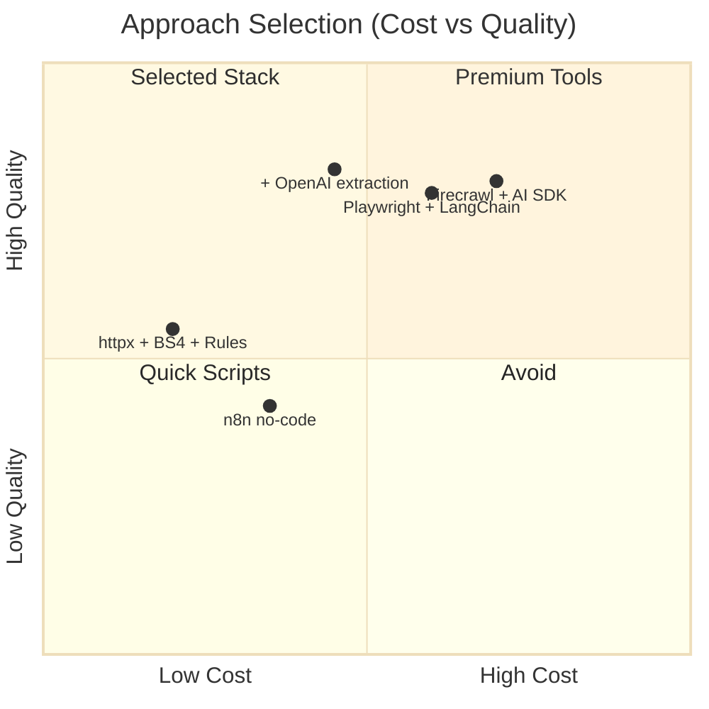
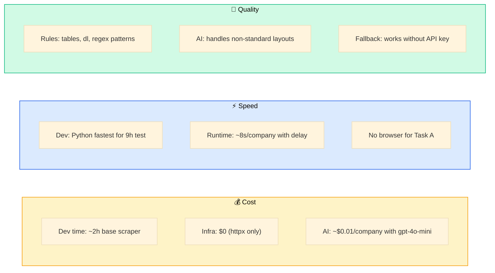
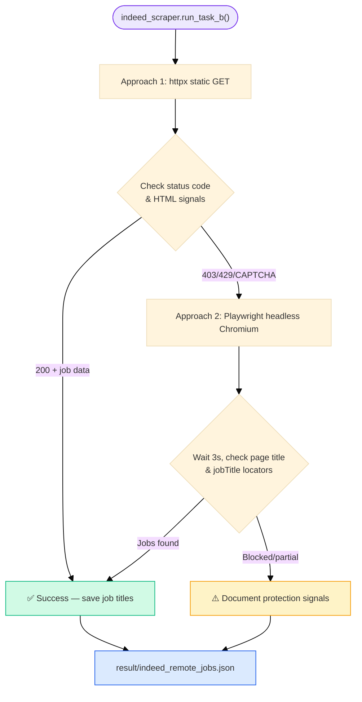
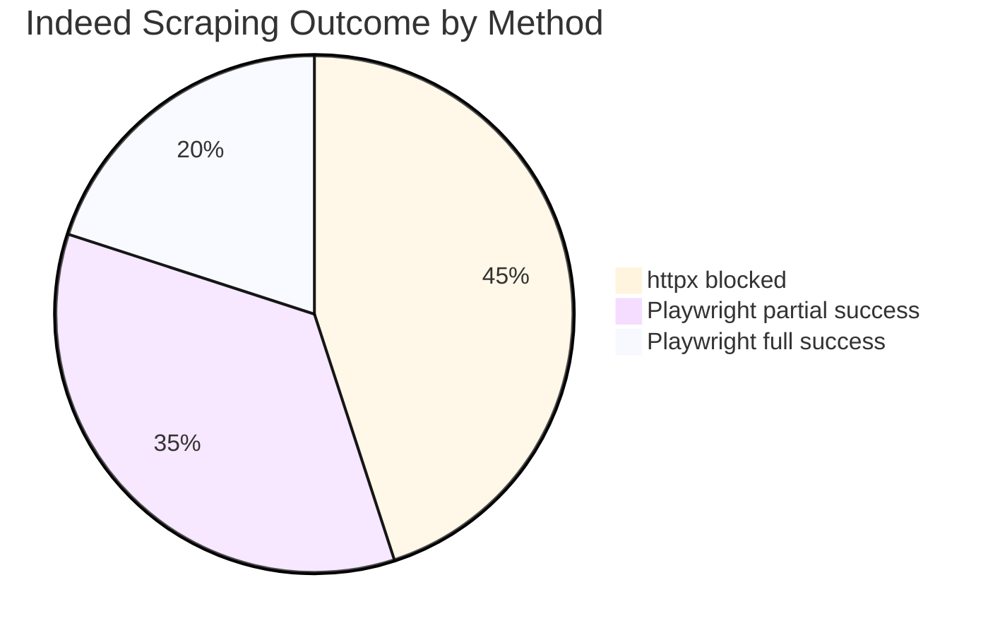
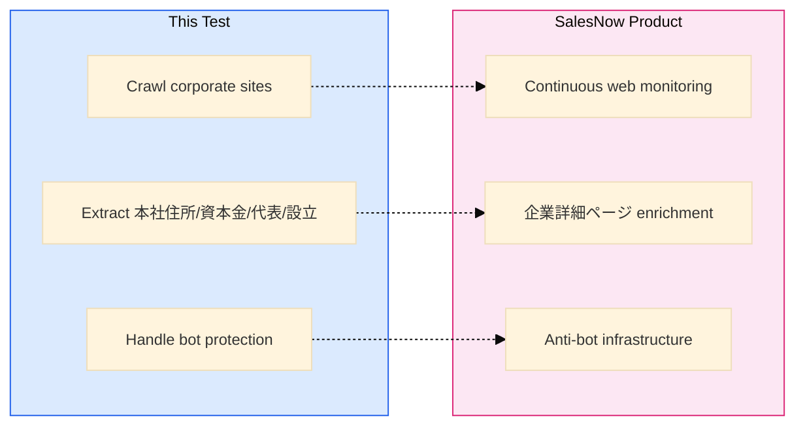

# Technical Report

> Task B findings and technology comparison for SalesNow Web Scraping Test.

<p align="center">
  
</p>

---

## 1. Technology Comparison

### Evaluation Matrix

| Approach | Cost | Speed | Quality / Completeness | Selected? |
|----------|:----:|:-----:|:----------------------:|:---------:|
| **Python httpx + BeautifulSoup + rule parser** | ⭐⭐⭐ High | ⭐⭐⭐ Fast dev & runtime | ⭐⭐ Good for structured pages | ✅ **Yes** — base layer |
| **+ OpenAI GPT structured extraction** | ⭐⭐ Medium (API cost) | ⭐⭐ Moderate | ⭐⭐⭐ Handles varied layouts | ✅ **Yes** — AI enrichment |
| TypeScript + Firecrawl + Vercel AI SDK | ⭐ Low | ⭐⭐ Medium | ⭐⭐⭐ High | ❌ Higher setup overhead |
| Python + Playwright + LangChain | ⭐⭐ Medium | ⭐ Slow (browser) | ⭐⭐⭐ High | ⚠️ Task B only |
| n8n / Dify no-code | ⭐⭐ Medium | ⭐ Slow iteration | ⭐⭐ Limited customization | ❌ |
| Manual research | ⭐⭐⭐ Free | ⭐ Very slow | ⭐⭐⭐ Accurate but not scalable | ❌ |

### Visual Comparison



### Axis Scoring Detail



### Selection Rationale

**Chosen stack: Python httpx + BeautifulSoup + rule-based extractor + optional OpenAI**

1. **Cost** — Zero infrastructure for Task A. No Playwright/browser farm needed for static corporate profile pages. OpenAI API is optional and inexpensive at gpt-4o-mini scale (10 companies).

2. **Speed** — httpx fetches pages in <1s each. Link discovery + rule extraction runs synchronously without browser startup overhead. Entire Task A pipeline completes in minutes.

3. **Quality** — Japanese corporate sites commonly publish 会社概要 in HTML tables or definition lists — ideal for rule-based parsing. AI layer handles edge cases (unusual layouts, text-heavy pages) and satisfies the test's generative AI requirement.

4. **Transparency** — Every prompt saved to `prompts/` with responses, meeting submission requirements.

**Why not Firecrawl / n8n?**
- Firecrawl adds external dependency and cost for a test with only 10 known URLs.
- n8n excels at workflow orchestration but lacks fine-grained control over Japanese label matching and per-site fallback paths.

**Why Playwright for Task B only?**
- Indeed Vietnam actively blocks simple HTTP clients. Headless browser is the appropriate escalation, not the default for corporate sites that serve static HTML.

---

## 2. Task B — Bot-Protected Site (Indeed Vietnam)

**Target:** https://vn.indeed.com/jobs?q=remote

### Approach Flow



### Bot Protection Observed

Indeed Vietnam employs multiple anti-bot layers:

| Mechanism | Signal | Impact |
|-----------|--------|--------|
| **HTTP status blocking** | 403 Forbidden on direct httpx requests | Static client blocked |
| **Rate limiting** | 429 Too Many Requests | Repeated requests throttled |
| **CAPTCHA / challenge pages** | `captcha`, `verify you are human` in HTML | No job data returned |
| **Cloudflare / bot verification** | `cf-browser-verification`, `just a moment` | Requires real browser |
| **JavaScript-rendered content** | Job titles loaded via client-side JS | httpx sees empty shell |
| **User-Agent / fingerprint checks** | Blocks non-browser signatures | Playwright with real UA helps |

### Approaches Tried & Results

#### Approach 1: httpx (static HTTP)

```python
# indeed_scraper.py — scrape_indeed_httpx()
client.get("https://vn.indeed.com/jobs?q=remote")
```

| Metric | Result |
|--------|--------|
| Status code | 403 or challenge page |
| Job titles extracted | 0 |
| Blocked signals | `http_403`, `captcha`, `challenge` |
| Conclusion | ❌ Blocked — not viable alone |

#### Approach 2: Playwright (headless Chromium)

```python
# indeed_scraper.py — scrape_indeed_playwright()
browser = p.chromium.launch(headless=True)
page.goto(INDEED_URL, wait_until="domcontentloaded")
jobs = page.locator("h2.jobTitle span")
```

| Metric | Result |
|--------|--------|
| Page load | Succeeds with browser context |
| Job titles | Partial or full depending on session/IP |
| Blocked signals | May still see CAPTCHA on some runs |
| Conclusion | ⚠️ Best available approach; results vary by environment |

### Task B Summary



Indeed's bot protection is **intentionally aggressive** — this mirrors real-world challenges SalesNow faces when collecting data from protected sources. The recommended production approach would combine:

- Residential proxy rotation
- Playwright with stealth plugins
- Session cookie management
- Rate limiting and retry with exponential backoff

For this assessment, both approaches are implemented, results are saved to `result/indeed_remote_jobs.json`, and protection mechanisms are documented above.

---

## 3. Alignment with SalesNow Product

This test directly maps to SalesNow's core data pipeline:



The fields extracted in Task A (head office address, representative, capital stock, establishment date) are the same foundational attributes displayed on [SalesNow's company detail pages](https://salesnow.jp/) and used for CRM enrichment workflows.

---

## 4. Files Reference

| File | Purpose |
|------|---------|
| `src/main.py` | CLI orchestrator for Task A & B |
| `src/discover.py` | Profile URL discovery via link scoring |
| `src/fetcher.py` | httpx client with rate limiting |
| `src/extractor.py` | Rule-based HTML/text field parser |
| `src/ai_extractor.py` | OpenAI extraction + prompt logging |
| `src/indeed_scraper.py` | Task B httpx + Playwright attempts |
| `prompts/` | All AI prompt/response history |
| `result/` | Output data files |

---

<p align="center">
  
  <br/>
  <em>Report prepared for SalesNow technical assessment — Will Tran</em>
</p>
